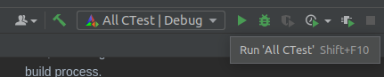

[](https://classroom.github.com/a/sBZ4nuVC)
# stella-with-simple-extensions
Template repository for Stella implementation with simple extensions.

# C++ stella-implementation-assignment

This is the skeleton for a C++ implementation of the Stella programming language interpreter.

### Requirements

This was tested with:

* make 4.1
* BNFC 2.9.4.1
* flex 2.6.4
* bison 3.8.2
* g++ 11.2.0
* cmake 3.23.0-rc5
* ninja 1.8.2

### Building and running the interpreter

1. To build the interpreter run:

```sh
make
```

This typically involves running BNFC converter, and compiling the project in the chosen language,
resulting in an executable `build/stella-interpreter` that you can now use to type check and interpret programs.

2. Now, to run the type checker:

```sh
make typecheck
```

This starts the type checker waiting to input the program. Note that it will accept input until it encounters the end of file (Ctrl+D).

3. To run the interpreter:

```sh
make interpret <filename>
```

This starts the interpreter reading the program from the input file and waiting for the input of the argument for the _main_ function.

### Code Structure

[Interpret.cpp](Interpret.cpp) is the main file that contains the logic for reading a program and its arguments (if you run an interpreter).

[TypeCheck.h](TypeCheck.h) and [TypeCheck.cpp](TypeCheck.cpp) files assume the content of the type checker logic. Currently they contain only prototypes of the functions for further implementation.
The input program from the interpreter is passed directly to the `typecheckProgram` function.

[Eval.h](Eval.cpp) and [Eval.cpp](Eval.cpp) files similarly imply the logic of interpreting the program. They also contain only prototypes. The input program (read from the file) and the argument (entered after the interpreter starts) are passed directly to the `evalMainWith` function.

### How to develop

You must extend the existing files to perform the required actions.
If you need to add additional files, don't forget to add them to the [CMake file](CMakeLists.txt) (in the SRCS variable) to include them in the build process. 


### My Solution

I create class ObjectType where I store all object types such as int, bool, function, recursion.
This class contain:
- typeTag - is enum type which determine type of object
- params - is list of self object, It's for functions and recursion. It's show list of accept types
- returns  - is list of self object which should return, but always we have only one element. Actually we can use one ObjectType, but at the begining I have trouble and then decide to use vector

In class Visiting I add new atributes:

- contextIdent - it's map which return type for identifiers
- expected_type - it's temporary Object type, which help to compare actual and expected types
- contexts - It's stack where store objectTypes when traversing AST. When we come in new node in AST I add the type to context, and when go out from this node in ```contexts.top()``` will be type of this node which I leave . So I will work with this object ```contexts.top()```.

#### Updates

In objectType class added new fields:
- records - it's for recores, where store list of pair, where first is identifier and second value. At the begining I want use unordered_map but I got errors and I can't solved them.

In enums I added new fields such as UnitTypeTag,  TupleTypeTag,  SumTypeTag,  ListTypeTag,  RecordsTypeTag,

Tuples:
- To store values in tuple, I use params vector where store type of every object.

Sum types:
...


#### Updates #2
To enum added fiels:
- ReferenceTypeTag,
- PanicTypeTag,

In class Visting added two functions which check subtypeing:
- subTypeFunc 
- subTypeRecord 

### How I run the code

Sanzhar Zhainalin help me to configure CMakeList.txt, this file will run all test. You need just click one button run all test


#### Show Errors:

When running some ill-typed test, the program show not exact line where mistakes, but it's not work proper.


### Idea

The idea of using enum and store object inspired by Yaroslav Kim. I asked advice from Yaroslav how to better store objects.

### Tests
ill-typed:
- bad-if-and-undefined-variable-1.stella
- function-mismatch.stella

well-typed
- abstract-functions.stella
- simple-succ.stella

It's from previous assignment


Also I added the test from site stella, also I little modified and add:

sum-types/well-typed/
- sample-1.stella
- sample-2.stella

sum-types/ill-typed/
- mismatch-arg.stella

unit/well-typed
- sample.stella

unit/ill-typed
- mismatch.stella